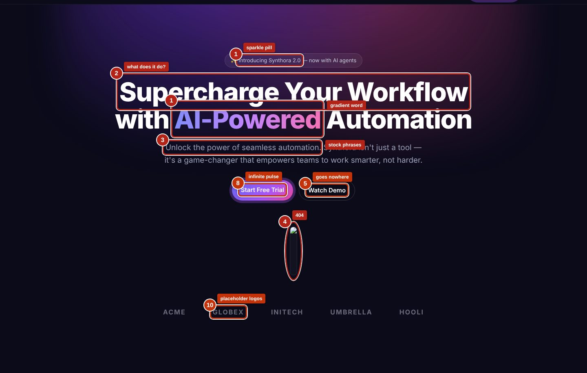

# Site Roast

Give an AI agent a website URL and get back a PDF that judges it the way a design director, a
conversion copywriter and a front-end engineer would, with every problem circled on a screenshot.



*From the [demo report](examples/demo/report.pdf): a fictional landing page that ships with this repo
as a test target. Numbers on the screenshot match the numbered findings in the report.*

## What it checks

- **AI giveaways** in copy ("unlock the power of seamless…", "it's not just X, it's Y") and in design
  (purple-gradient hero with one gradient word, emoji feature cards, the cream/serif/eyebrow "tasteful AI" look)
- **Design judgment**: art direction, typography, colour and theme, layout, imagery, motion,
  consistency across pages, and whether the look fits the buyer and the price
- **Pitch and conversion**: does the page say what it sells, to whom, why this over the alternative,
  and is the next step obvious and working
- **Responsiveness** at 390, 768, 1024 and 1440 px: overflow (with the culprit element), tap targets, tiny text
- **Accessibility and performance** (Lighthouse), **SEO**, and **bugs**: JS errors, broken images and links, dead anchors
- **Security and backend, passively**: headers, HTTPS, cookies, keys shipped in client code, third
  parties, which backends the code talks to, how forms submit

## What you get

A PDF with the same 16 sections every time, so you know what to expect. A section that doesn't apply is
listed as "not applicable" with the reason instead of disappearing.

1. Scorecard · 2. Executive summary · 3. Designer's judgment · 4. Content, pitch & conversion ·
5. Bugs · 6. Issue register · 7. Page by page (annotated) · 8. Motion & interaction · 9. Themes & colour ·
10. Responsiveness · 11. Accessibility · 12. Performance · 13. Security & backend · 14. SEO ·
15. Language & localisation · 16. Method

Every finding has a severity (roast / fix / nit), a type (bug or issue), a confidence level, the evidence
(a quote, a number, or something visible) and a concrete fix. Details:
[report format](.claude/skills/site-roast/references/report-format.md) ·
[scoring rubric](.claude/skills/site-roast/references/rubric.md) ·
[data schema](.claude/skills/site-roast/references/roast-schema.md).

## How it works

Site Roast doesn't try to be clever on its own. The judging is done by an agent using **22 existing
open-source agent skills** (copied into `.claude/skills/`, pinned to exact commits, updated weekly by a
GitHub Action). This repo adds the parts those skills don't have:

```
URL ─► capture ─────────────► agent review ─────────────► report
       crawl + 4 breakpoints   follows the site-roast skill  validate roast.json
       screenshots, filmstrip  using the vendored skills     draw numbered markers on the
       theme / motion / layout writes roast.json             live pages, crop, build PDF
       bugs / network / a11y   (findings + where to point)
       security / links / SEO
```

| Step | Command | Output |
|---|---|---|
| Capture | `npm run capture -- <url> --max=15 --lighthouse` | `runs/<host>-<date>/`: screenshots, measured evidence, scanner results |
| Review | the agent follows [`site-roast/SKILL.md`](.claude/skills/site-roast/SKILL.md) | `runs/<id>/roast.json` |
| Report | `npm run report` | `runs/<id>/report.pdf` with annotated screenshots |

## Quick start

Requirements: Node 18+, and [Claude Code](https://claude.com/claude-code) (or any agent that can read
`SKILL.md` files and run shell commands).

```bash
git clone https://github.com/MarioMagdy/Site-Roast.git
cd Site-Roast
npm install
npx playwright install chromium   # or set CHROME_PATH to an existing Chrome/Chromium
npm test
```

Then open the folder in Claude Code and ask:

```
roast https://example.com
```

Try it on the bundled demo site first:

```bash
node examples/demo-site/serve.mjs 4173 &   # then: roast http://localhost:4173
```

You can also run the steps by hand. `npm run capture` and `npm run report` work without an agent, but
someone (or something) has to write `roast.json` in between.

## Skills it builds on

| Area | Skills | Upstream |
|---|---|---|
| AI copy | ai-writing-detector, avoid-ai-writing | [conorbronsdon/avoid-ai-writing](https://github.com/conorbronsdon/avoid-ai-writing) (MIT) |
| AI copy | humanizer | [blader/humanizer](https://github.com/blader/humanizer) (MIT) |
| AI design | avoid-ai-design | [funboy322/avoid-ai-design](https://github.com/funboy322/avoid-ai-design) (MIT) |
| AI design | hallmark | [nutlope/hallmark](https://github.com/nutlope/hallmark) (MIT) |
| AI design | frontend-design | [anthropics/skills](https://github.com/anthropics/skills) (Apache-2.0) |
| Taste | design-taste-frontend, redesign-existing-projects | [Leonxlnx/taste-skill](https://github.com/Leonxlnx/taste-skill) (MIT) |
| Visual craft | impeccable | [pbakaus/impeccable](https://github.com/pbakaus/impeccable) (Apache-2.0) |
| UI guidelines | web-design-guidelines | [vercel-labs/agent-skills](https://github.com/vercel-labs/agent-skills) (MIT) |
| Web quality | web-quality-audit, accessibility, performance, core-web-vitals | [addyosmani/web-quality-skills](https://github.com/addyosmani/web-quality-skills) (MIT) |
| Launch checks | pre-launch-audit | [bzsasson/pre-launch-audit-skill](https://github.com/bzsasson/pre-launch-audit-skill) (MIT) |
| Pitch, CRO, SEO | product-marketing, cro, copywriting, copy-editing, marketing-psychology, seo-audit, ai-seo | [coreyhaines31/marketingskills](https://github.com/coreyhaines31/marketingskills) (MIT) |

Exact commits: [`skills.lock.json`](skills.lock.json). Licences and attribution:
[`THIRD_PARTY_NOTICES.md`](THIRD_PARTY_NOTICES.md). Each vendored folder keeps its upstream licence.

**Keeping them current:** `npm run sync` pulls the latest version of every skill in
[`skills.manifest.json`](skills.manifest.json); `npm run sync -- --locked` re-copies the pinned versions.
The weekly [sync workflow](.github/workflows/sync-skills.yml) opens a pull request when upstream changes,
so updates get reviewed before they land. (It needs *Settings → Actions → General → Allow GitHub Actions
to create pull requests*.)

## Responsible use

- **Passive only.** The security checks look at what any visitor's browser already receives. Site Roast
  never probes for hidden files, submits forms, tries logins or fuzzes anything. Keep it that way if you
  extend it.
- **No authorship claims.** An "AI tell" means a page uses defaults that generative tools overproduce. It
  is not proof of how the site was made, and the report says so.
- **Roast the page, not the person.** If you publish a report about someone else's site, check with them first.
- **Lab numbers are lab numbers.** Lighthouse runs with simulated throttling; treat it as directional.

## Project layout

```
.claude/skills/site-roast/   the orchestrator skill (workflow, rubric, schema, report format)
.claude/skills/<other>/      vendored upstream skills (don't edit; see UPSTREAM.md in each)
lib/crawl/                   capture: crawler, per-page probes, site-level checks
lib/scan/                    deterministic scanners (vendored detectors, readability, Lighthouse)
lib/annotate/                numbered markers on live pages + cropping
lib/report/                  schema, validation, section renderers, PDF
scripts/                     CLI entry points
examples/                    demo site + its report
```

More detail for contributors (and for agents working on the repo) is in [CLAUDE.md](CLAUDE.md) and
[CONTRIBUTING.md](CONTRIBUTING.md).

## Licence

[MIT](LICENSE) for the Site Roast code and the `site-roast` skill. The vendored skills under
`.claude/skills/` keep their own licences ([details](THIRD_PARTY_NOTICES.md)).
